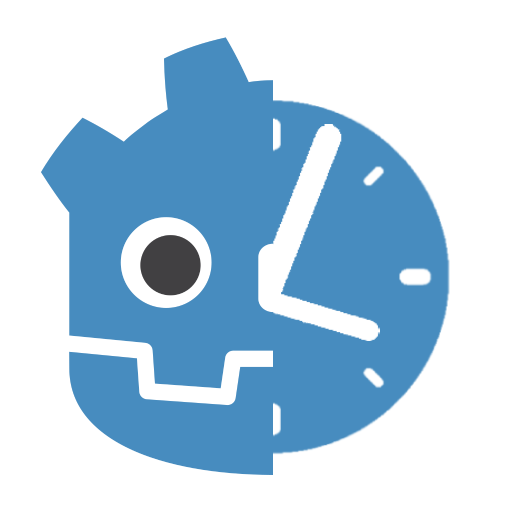

  
  <h2 align="center">Godot Daily Reward</h2>
  
  
Add-on that allows you to obtain a daily reward, useful for mobile games.

  
This addon serves as the foundation for all projects developed in <a href="https://gauchoforge.com/">Gaucho Forge. </a>

<h1 align="center">🔎 Stats</h1>

    
    
    

## 💰 Donations
❤️​ All donations go directly toward the development of my own games and the creation of free addons for Godot. Your support helps me create more and better projects. 
  
 

# 📄​ License
This project is licensed under the MIT License. You are free to modify and use it however you like. Credit is not required, but always appreciated.
